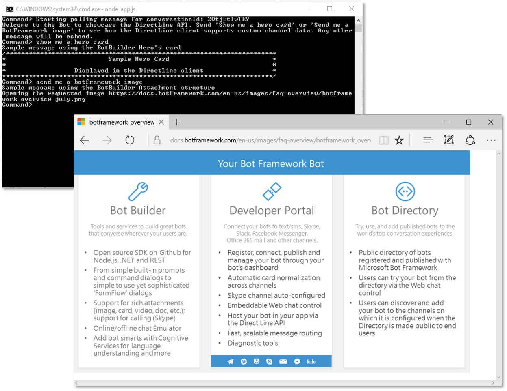

# Direct Line Bot Sample

A sample bot and a custom client communicating to each other using the Direct Line API.

[![Deploy to Azure][Deploy Button]][Deploy Node/DirectLine]

[Deploy Button]: https://azuredeploy.net/deploybutton.png
[Deploy Node/DirectLine]: https://azuredeploy.net

### Prerequisites

The minimum prerequisites to run this sample are:
* Latest Node.js with NPM. Download it from [here](https://nodejs.org/en/download/).
* The Bot Framework Emulator. To install the Bot Framework Emulator, download it from [here](https://emulator.botframework.com/). Please refer to [this documentation article](https://github.com/microsoft/botframework-emulator/wiki/Getting-Started) to know more about the Bot Framework Emulator.
* Register your bot with the Microsoft Bot Framework. Please refer to [this](https://docs.microsoft.com/en-us/bot-framework/portal-register-bot) for the instructions. Once you complete the registration, update your bot configuration with the registered config values (See [Debugging locally using ngrok](https://docs.microsoft.com/en-us/bot-framework/debug-bots-emulator) or [Deploying to Azure](https://docs.microsoft.com/en-us/bot-framework/publish-bot-overview)
* **[Recommended]** Visual Studio Code for IntelliSense and debugging, download it from [here](https://code.visualstudio.com/) for free.

#### Direct Line API
Credentials for the Direct Line API must be obtained from the Bot Framework developer portal, and will only allow the caller to connect to the bot for which they were generated.
In the Bot Framework developer portal, enable Direct Line in the channels list and then, configure the Direct Line secret and update its value in [DirectLineClient's app.js](DirectLineClient/app.js#L7) (`directLineSecret` variable). Make sure that the checkbox for version 3.0 [PREVIEW] is checked.
Refer to [this](https://docs.microsoft.com/en-us/bot-framework/portal-configure-channels) for more information on how to configure channels.


#### Publish
Also, in order to be able to run and test this sample you must [publish your bot, for example to Azure](https://docs.microsoft.com/en-us/bot-framework/publish-bot-overview). Alternatively, you can [Debug locally using ngrok](https://docs.botframework.com/en-us/node/builder/guides/core-concepts/#debugging-locally-using-ngrok).
Remember to update the environment variables with the `MICROSOFT_APP_ID` and `MICROSOFT_APP_PASSWORD` on the [.env](./DirectLineBot/.env) file.

### Code Highlights

The Direct Line API is a simple REST API for connecting directly to a single bot. This API is intended for developers writing their own client applications, web chat controls, or mobile apps that will talk to their bot. In this sample, we are using the [Direct Line Swagger file](https://docs.botframework.com/en-us/restapi/directline3/swagger.json) and [Swagger JS](https://github.com/swagger-api/swagger-js) to create a client for Node that will simplify access to the underlying REST API. Check out the client's [app.js](DirectLineClient/app.js#L7-L26) to see the client initialization.

````JavaScript
var directLineSecret = 'DIRECTLINE_SECRET';
var directLineClientName = 'DirectLineClient';
var directLineSpecUrl = 'https://docs.botframework.com/en-us/restapi/directline3/swagger.json';

var directLineClient = rp(directLineSpecUrl)
    .then(function (spec) {
        // client
        return new Swagger({
            spec: JSON.parse(spec.trim()),
            usePromise: true
        });
    })
    .then(function (client) {
        // add authorization header to client
        client.clientAuthorizations.add('AuthorizationBotConnector', new Swagger.ApiKeyAuthorization('Authorization', 'Bearer ' + directLineSecret, 'header'));
        return client;
    })
    .catch(function (err) {
        console.error('Error initializing DirectLine client', err);
    });
````

Each conversation on the Direct Line channel must be explicitly started using the `client.Conversations.Conversations_StartConversation()` function.
Check out the client's [app.js createConversation](DirectLineClient/app.js#L28-L41) function which creates a new conversation.

````JavaScript
// once the client is ready, create a new conversation
directLineClient.then(function (client) {
    client.Conversations.Conversations_StartConversation()                          // create conversation
        .then(function (response) {
            return response.obj.conversationId;
        })                            // obtain id
        .then(function (conversationId) {
            sendMessagesFromConsole(client, conversationId);                        // start watching console input for sending new messages to bot
            pollMessages(client, conversationId);                                   // start polling messages from bot
        })
        .catch(function (err) {
            console.error('Error starting conversation', err);
        });
});
````

Once the conversation is created, a `conversationId` is returned that we can use to call other endpoints to poll or send messages and other activities.
User messages are sent to the Bot using the Direct Line Client `client.Conversations.Conversations_PostActivity` function using the `conversationId` generated in the previous step.

````JavaScript
// send message
client.Conversations.Conversations_PostActivity(
    {
        conversationId: conversationId,
        activity: {
            textFormat: 'plain',
            text: input,
            type: 'message',
            from: {
                id: directLineClientName,
                name: directLineClientName
            }
        }
    }).catch(function (err) {
        console.error('Error sending message:', err);
    });
````

Messages from the Bot are continually polled from the API using an interval. Check out the client's [app.js](DirectLineClient/app.js#L80-L88) usage of `client.Conversations.Conversations_GetActivities` function which retrieves conversation messages newer than the stored watermark. Messages are then filtered from anyone but our own client using the [`printMessages`](DirectLineClient/app.js#L92-L107) function.

````JavaScript
var watermark = null;
setInterval(function () {
    client.Conversations.Conversations_GetActivities({ conversationId: conversationId, watermark: watermark })
        .then(function (response) {
            watermark = response.obj.watermark;                                 // use watermark so subsequent requests skip old messages
            return response.obj.activities;
        })
        .then(printMessages);
}, pollInterval);
````

DirectLine v3.0 (unlike version 1.1) has supports for Attachments (see [Send and receive attachments](https://docs.microsoft.com/en-us/bot-framework/nodejs/bot-builder-nodejs-send-receive-attachments) for more information about attachments).
Check out the [`printMessage`](DirectLineClient/app.js#L109-L128) function to see how the Attachments are retrieved and rendered appropriately based on their type.

````JavaScript
function printMessage(activity) {
    if (activity.text) {
        console.log(activity.text);
    }

    if (activity.attachments) {
        activity.attachments.forEach(function (attachment) {
            switch (attachment.contentType) {
                case "application/vnd.microsoft.card.hero":
                    renderHeroCard(attachment);
                    break;

                case "image/png":
                    console.log('Opening the requested image ' + attachment.contentUrl);
                    open(attachment.contentUrl);
                    break;
            }
        });
    }
}
````

### Outcome

To run the sample, you'll need to run both Bot and Client apps.

* Running Bot app
  1. Open a CMD console and CD to sample's `DirectLineBot` directory
  2. Run `node app.js`
* Running Client app
  1. Open a CMD console and CD to sample's `DirectLineClient` directory
  2. Run `node app.js`

To test the ChannelData custom messages type in the Client's console `show me a hero card` or `send me a botframework image` and you should see the following outcome.



### More Information

To get more information about how to get started in Bot Builder for Node and Direct Line API please review the following resources:
* [Bot Builder for Node.js Reference](https://docs.microsoft.com/en-us/bot-framework/nodejs/)
* [Bot Framework FAQ](https://docs.microsoft.com/en-us/bot-framework/resources-bot-framework-faq#i-have-a-communication-channel-id-like-to-be-configurable-with-bot-framework-can-i-work-with-microsoft-to-do-that)
* [Direct Line API - v3.0](https://docs.botframework.com/en-us/restapi/directline3/)
* [Direct Line Swagger file - v3.0](https://docs.botframework.com/en-us/restapi/directline3/swagger.json)
* [Swagger-JS](https://github.com/swagger-api/swagger-js)
* [Send and receive attachments](https://docs.microsoft.com/en-us/bot-framework/nodejs/bot-builder-nodejs-send-receive-attachments)
* [Debugging locally using ngrok](https://docs.microsoft.com/en-us/bot-framework/debug-bots-emulator)
